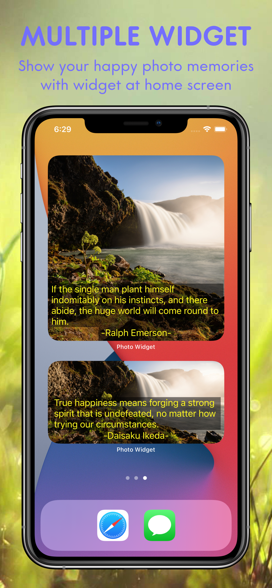
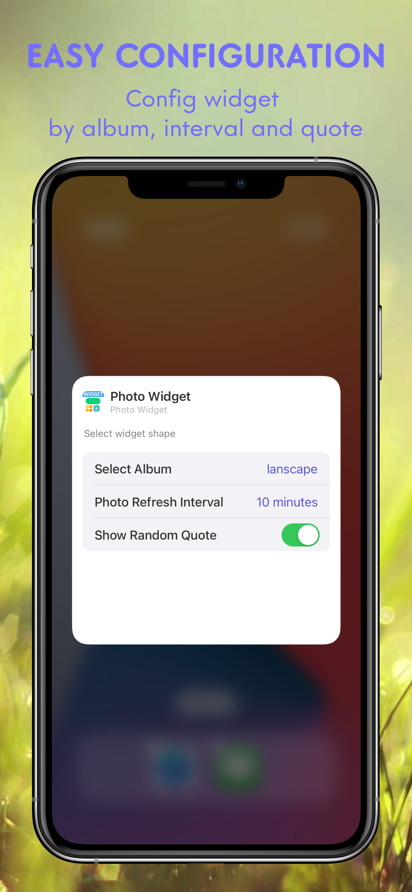

<h3 align="center"> Photo Widget: Multiple Widgets</h3>

---

Photos & Album on home screen

### Description:
You can freely create the iOS14 widgets from the photo library of your device and display your favorite photos right on your home screen iPhone and iPad free

Features:
• Show your happy photo memories with widget and home
• Easy to select your album or photos, create widgets, and view the photos you have selected
• Adding an album that will alway refresh
• Adding a single photo widget
• Adjust interval to refresh all your pictures
• Make a unique layout of multiple widgets
• Use the stack feature to stack multiple widgets
• Share your awesome edits easily with your friends

■ Supports new widgets for iOS 14

We appreciate and value your opinion
You are welcome to contact us at support@email........

Thank you.

### Download

### Contact us:

Get in touch with me for support via: [Messenger](https://m.me/416305462459391)

